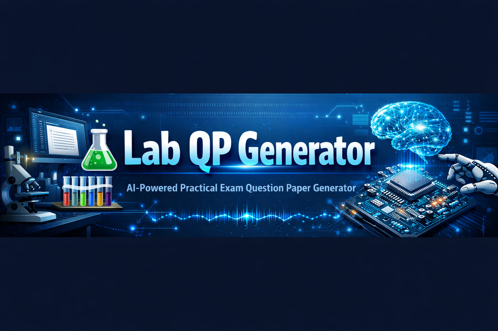
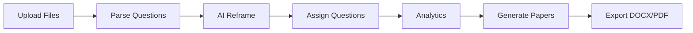

  

# 🧪 Lab QP Generator v7 · AI-Powered Practical Examination System

An advanced **web-based Question Paper Generator** designed for **engineering practical/lab exams**.
This system automates everything from **question parsing → AI-based reframing → student assignment → compact print-ready export (DOCX/PDF)**.

---

## 🚀 Key Features

### 📁 1. Smart File Upload

* Upload **Question Bank (.docx)**
* Upload **Student Database (.xlsx)**
* Auto-detect:

  * Exam Title
  * Subject
  * Department
  * Rubrics
  * Question structure

---

### 🧠 2. AI Reframe Engine (Core Feature)

Supports **multi-source AI + offline fallback**:

* 🖥 Offline (built-in templates)
* 🟢 OpenAI GPT
* 🔵 Google Gemini
* 🟠 Claude

#### ✨ Reframing Capabilities

* Bloom’s Taxonomy Levels (K1 → K6)
* Harder / Easier questions
* Numeric variation
* Similar context generation
* Lab-focused question conversion

---

### 🎓 3. Bloom’s Taxonomy Integration

| Level | Type       | Description           |
| ----- | ---------- | --------------------- |
| K1    | Remember   | Recall facts          |
| K2    | Understand | Explain concepts      |
| K3    | Apply      | Perform experiments   |
| K4    | Analyze    | Compare & investigate |
| K5    | Evaluate   | Justify & critique    |
| K6    | Create     | Design & develop      |

---

### 📊 4. Question Assignment System

* ⚖️ Equal Weightage Mode
* 🎲 Random Mode
* ✏️ Manual Assignment

#### Includes:

* Student-wise assignment
* Question usage tracking
* Coverage analytics
* Heatmaps & distribution charts

---

### 📄 5. Compact Paper Generation

* 📏 **11pt Times New Roman**
* 📄 **2 students per page**
* 🧾 No wasted space
* 🖨 Print-ready format

---

### 📦 6. Export Options

* 📄 DOCX (Merged)
* 📑 PDF (High quality)
* 📦 ZIP (Individual papers)

---

## 🧩 System Workflow

---

## 🛠️ Tech Stack

* **Frontend:** HTML5, CSS3, Vanilla JavaScript
* **Libraries:**

  * JSZip (DOCX generation)
* **AI Integration:**

  * OpenAI API
  * Google Gemini API
  * Claude API
* **Rendering:**

  * Canvas-based PDF generation

---

## 🔐 AI API Setup (Optional)

1. Select AI Provider:

   * OpenAI / Gemini / Claude
2. Enter API Key
3. Click **Test Connection**

> ⚠️ API keys are used **only in browser** and never stored.

---

## 📂 Input File Formats

### 📝 Question Bank (.docx)

* Must contain:

  * Questions
  * Marks
  * Optional rubrics

### 👥 Student Database (.xlsx)

Columns supported:

* Register No
* Student Name
* Department
* Year
* Semester

---

## 📸 UI Highlights

* Inline question reframing ✨
* Real-time analytics 📊
* Step-by-step workflow navigation
* Glass UI with modern design

---

## ⚡ Performance Features

* Fast offline reframing
* Progressive PDF generation
* Optimized DOCX builder
* Minimal memory footprint

---

## 🎯 Use Cases

* Engineering Colleges
* Polytechnic Institutions
* Lab Examinations
* Internal/External Practical Exams

---

## 🧑‍💻 Author

**Alwyn Rajiv S.**
Assistant Professor – ECE
Specialization: FPGA, AI, Data Science, IoT

---

## 📜 License

This project is intended for **educational and academic use**.

---

## 💡 Future Enhancements

* Cloud storage integration ☁️
* Multi-language support 🌍
* Question difficulty balancing AI 🤖
* LMS integration 📚

---

## ⭐ Support

If you find this useful:

* ⭐ Star the repo
* 🍴 Fork it
* 🧠 Contribute improvements

---

### 🔥 “From manual paper setting → fully automated AI-driven exam generation”
